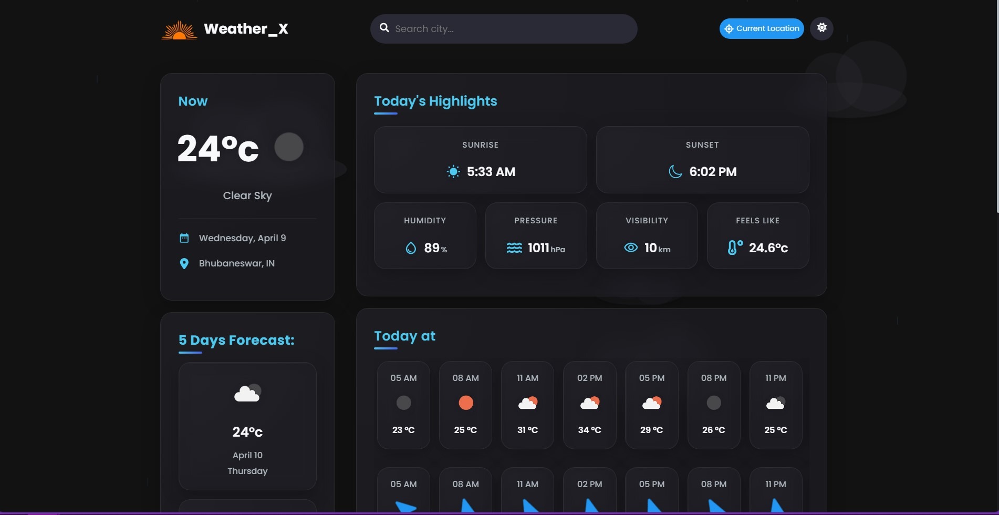

# Weather_X Dashboard Application

## Table of Contents

- [Overview](#overview)
- [Built with](#built-with)
- [Screenshot](#screenshot)
- [Links](#links)
- [Features](#features)
- [Project Structure](#project-structure)
- [API Integration](#api-integration)


### Overview

This is a Weather Dashboard application designed to provide users with up-to-date and comprehensive weather information. With its user-friendly interface and intuitive design, the dashboard offers a range of features to help users stay informed about current conditions and forecasts.

### Built with

- ReactJs
- CSS Modules
- RESTful API
- Context API
- Vite
- ESLint and Prettier for code linting and formatting
- Designed with modern UI principles

### Screenshot



### Links

- Live Site URL : [[Weather_X Application](https://weather-app-alpha-eight-55.vercel.app/)](#)

### Features

- default city is Cairo, EG, providing weather information for this location.
- Real-time weather data based on the user's current geographical location if you click on Current Location button.
- search for any city and instantly view its weather conditions.
- Get Today's Highlights, including the Sunrise & Sunset times, Humidity, Pressure, Visibility, and "Feels Like" temperature.
- Daily Weather Forecast, including updates every 3 hours and the corresponding Wind Speed.
- Access a 5-day Weather Forecast.
- Light and Dark Modes, represented by a sun or moon icon. Your chosen mode is saved using local storage.

### Lighthouse Report Metrics

- **Desktop Metrics:**

  - Performance: Outstanding at 99%
  - Accessibility: High score of 95%
  - Best Practices: High score of 93%
  - SEO: Perfect score of 100%

- **Mobile Metrics:**
  - Performance: Solid at around 90%
  - Accessibility: High score of 94%
  - Best Practices: High score of 93%
  - SEO: Impressive score of 97%

The Lighthouse report provides valuable metrics for both desktop and mobile, showcasing outstanding performance, accessibility, best practices, and SEO optimization.
These metrics reflect a well-optimized and compliant website.

## Project Structure

- `src/` : Source code directory
  - `assets/` : Image files, stylesheets, or other static assets
  - `components/` : React components
    - `ComponentName.jsx` : component
    - `ComponentName.module.css` : Stylesheet for the component using CSS modules
  - `context/` : Context providers for the Context API
  - `Hooks/` : some custom hooks i needed
  - `App.jsx` : Main application component which is the `<Layout />`
  - `index.css` : Global stylesheet
  - `main.js` : Entry point of the application
- `public/` : Public assets and `index.html`
- `.eslintrc.cjs` : ESLint configuration file
- `.env.local` : Local environment variables (sensitive, not committed to version control)
- `vercel.json` : Vercel configuration file
- `package.json` : Project configuration and dependencies
- `vite.config.js` : Vite configuration file

## API Integration

The Weather Dashboard uses OpenWeatherMap API for fetching weather data.

### Fetching Data

```javascript
const apiKey = "YOUR_API_KEY";
const city = "YourCity";

fetch(
  `https://api.openweathermap.org/data/2.5/weather?q=${city}&appid=${apiKey}`,
)
  .then((response) => response.json())
  .then((data) => displayWeather(data))
  .catch((error) => console.error("Error:", error));
```


